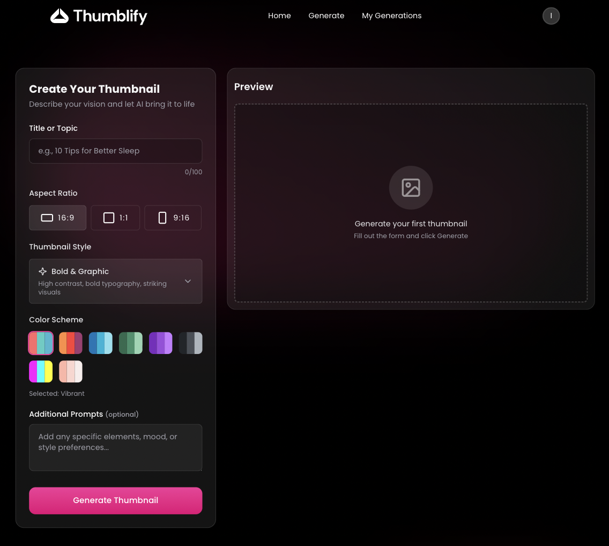

# Thumblify-MERN-frontend

A modern web application that generates images from text prompts using AI, this app provides a smooth and responsive interface for turning ideas into visuals in just a few seconds.

## Features

- Generate images from text prompts
- view, delete and download generated images
- preview images in Youtube layout
- Fast and responsive UI
- Modern design
- AI-Powered

## Tech Stack

- React
- TypeScript
- TailwindCSS
- Gemini API
